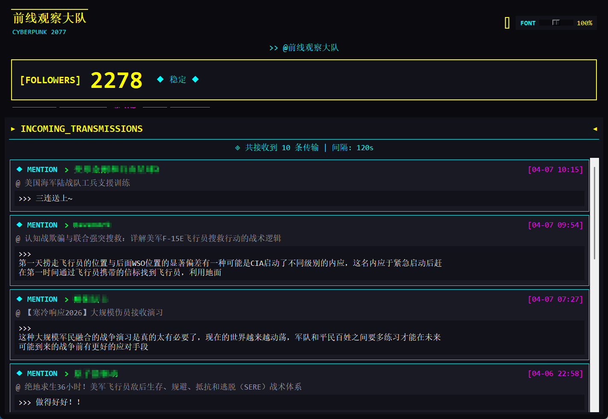

# B站数据看板 - CYBERPUNK 2077 Edition

B站UP主可以通过此面板监控粉丝订阅数量和留言，赛博朋克风格界面。



## 功能特点

- **实时数据监控** - 粉丝数实时更新（每分钟自动刷新）
- **消息通知** - 显示最新的评论回复和@提及
- **蜂鸣提醒** - 新关注蜂鸣1声，新回复蜂鸣3声
- **字号调节** - 右上角滑块调节字体大小（50%-150%）
- **数据变化追踪** - 从启动开始计算增长，直观显示变化
- **头像显示** - 自动加载B站头像
- **一键跳转** - 点击消息卡片直接跳转到B站回复页面
- **窗口置顶** - 可设置窗口始终置顶显示
- **赛博朋克UI** - 霓虹黄+青蓝+黑色科技风

## 快速开始

### 方式一：直接运行exe（推荐）

1. 下载 `B站数据看板.exe`
2. 双击运行即可

### 方式二：运行Python源码

```bash
# 安装依赖
pip install pillow requests

# 运行程序
python bilibili_dashboard.py
```

## 设置Cookie

消息功能需要B站登录状态：

1. 浏览器登录 [B站](https://www.bilibili.com)
2. 按 `F12` 打开开发者工具
3. Application → Cookies → bilibili.com → SESSDATA
4. 复制 SESSDATA 值
5. 点击程序中的 `KEY` 按钮，粘贴保存

## 按钮说明

| 按钮 | 功能 |
|------|------|
| SYNC | 刷新数据 |
| MARK | 标记当前数据为基准 |
| TOP | 切换窗口置顶 |
| KEY | 设置Cookie |
| MSG | 刷新消息列表 |

## 自行打包

```bash
pip install pyinstaller
python build_exe.py
```

输出：`dist/B站数据看板.exe`

## 技术栈

- Python 3.8+
- Tkinter - GUI
- Pillow - 图像处理
- Requests - HTTP请求

## 免责声明

本项目仅用于学习和个人使用，请遵守B站相关服务条款。

## 开源协议

MIT License

---

Made with neon lights by 前线观察大队
